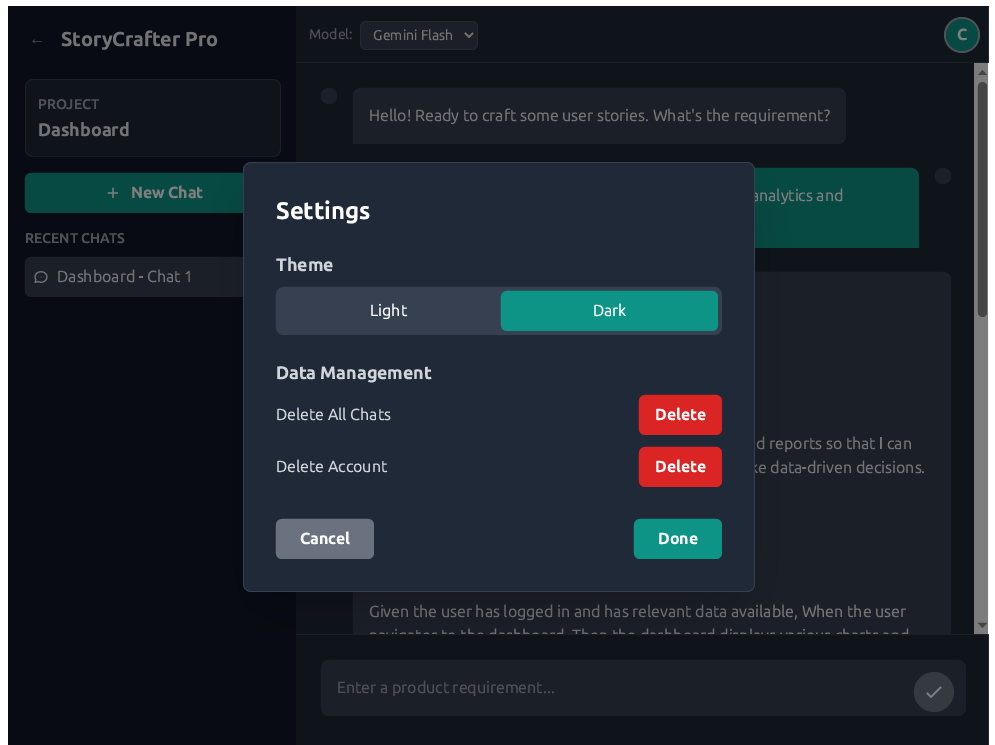

# StoryCrafter

A comprehensive Python framework for testing REST APIs with support for various HTTP methods, authentication, and detailed reporting.

## UI Screenshots

### Authentication Pages


### Dashboard & Interface


### Project Management


### User Profile & Settings




## Features

- **HTTP Methods Support**: GET, POST, PUT, DELETE, PATCH, etc.
- **Authentication**: Basic Auth, Bearer Token, API Key
- **Test Management**: Organized test suites with detailed results
- **Response Validation**: Status code and response body validation
- **Logging**: Comprehensive logging with file and console output
- **Reporting**: Detailed test reports with success rates
- **Error Handling**: Robust error handling and recovery
- **JSON Export**: Save test results to JSON format

## Installation

1. Clone or download the project files
2. Install dependencies:
   ```bash
   pip install -r requirements.txt
   ```

## Quick Start

### Basic Usage

```python
from main import APITester

# Initialize the tester
tester = APITester(base_url="https://api.example.com")

# Set authentication (optional)
tester.set_auth('bearer', token='your-token-here')

# Set custom headers (optional)
tester.set_headers({'Content-Type': 'application/json'})

# Run a single test
result = tester.test_endpoint(
    test_name="Get Users",
    method="GET",
    endpoint="/users",
    expected_status=200
)

# Generate and print report
print(tester.generate_report())
```

### Running Test Suites

```python
# Define your test suite
test_suite = [
    {
        'test_name': 'Get All Users',
        'method': 'GET',
        'endpoint': '/users',
        'expected_status': 200
    },
    {
        'test_name': 'Create User',
        'method': 'POST',
        'endpoint': '/users',
        'expected_status': 201,
        'json': {
            'name': 'John Doe',
            'email': 'john@example.com'
        }
    },
    {
        'test_name': 'Update User',
        'method': 'PUT',
        'endpoint': '/users/1',
        'expected_status': 200,
        'json': {
            'name': 'Jane Doe',
            'email': 'jane@example.com'
        }
    }
]

# Run the test suite
results = tester.run_test_suite(test_suite)

# Save results to file
tester.save_results("my_test_results.json")
```

## Authentication Methods

### Basic Authentication
```python
tester.set_auth('basic', username='user', password='pass')
```

### Bearer Token
```python
tester.set_auth('bearer', token='your-jwt-token')
```

### API Key
```python
tester.set_auth('api_key', api_key='your-api-key')
```

## Test Configuration Options

Each test in a test suite can include the following parameters:

- `test_name`: Name of the test (required)
- `method`: HTTP method (GET, POST, PUT, DELETE, etc.)
- `endpoint`: API endpoint path
- `expected_status`: Expected HTTP status code
- `json`: JSON payload for POST/PUT requests
- `data`: Form data for POST/PUT requests
- `params`: Query parameters
- `headers`: Request-specific headers
- `timeout`: Request timeout (overrides default)

## Output Files

The framework generates several output files:

- `api_test.log`: Detailed logging information
- `test_results.json`: JSON export of test results
- Console output: Real-time test progress and final report

## Example Output

```
API Test Report
===============
Generated: 2024-01-15 14:30:25

Summary:
- Total Tests: 4
- Passed: 3
- Failed: 1
- Errors: 0
- Success Rate: 75.0%

Detailed Results:

Test: Get Posts
Status: PASS
Response Time: 0.45s
Status Code: 200
--------------------------------------------------

Test: Create Post
Status: FAIL
Response Time: 0.32s
Status Code: 400
Error: Expected status 201, got 400
--------------------------------------------------
```

## Running the Example

To run the included example:

```bash
python main.py
```

This will run a test suite against the JSONPlaceholder API and display the results.

## Customization

You can extend the framework by:

1. **Adding Custom Validators**: Override the `test_endpoint` method to add custom validation logic
2. **Custom Report Formats**: Extend the `generate_report` method for different output formats
3. **Additional Authentication**: Add new authentication methods to the `set_auth` method
4. **Test Data Management**: Integrate with external data sources for test data

## Error Handling

The framework handles various types of errors:

- **Network Errors**: Connection timeouts, DNS failures
- **HTTP Errors**: 4xx and 5xx status codes
- **Validation Errors**: Unexpected response formats
- **Authentication Errors**: Invalid credentials or tokens

All errors are logged and included in the test results for analysis.

## Best Practices

1. **Use Descriptive Test Names**: Make test names clear and descriptive
2. **Group Related Tests**: Organize tests by functionality or endpoint
3. **Set Appropriate Timeouts**: Adjust timeouts based on API response times
4. **Validate Response Content**: Check both status codes and response bodies
5. **Handle Authentication Properly**: Use secure methods for storing credentials
6. **Regular Logging**: Monitor logs for debugging and performance analysis

## Contributing

Feel free to extend this framework with additional features such as:

- Parallel test execution
- Performance benchmarking
- GraphQL support
- WebSocket testing
- Database integration
- CI/CD integration

## License

This project is open source and available under the MIT License. 